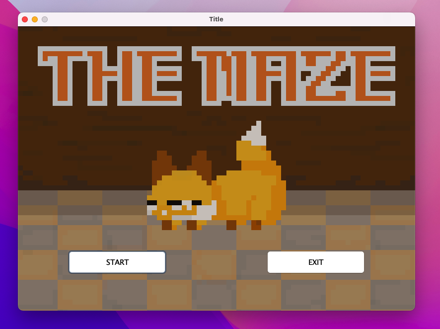

# TheMaze

## ゲームの概要
キツネが迷路を探索して、鍵を見つけゴールを目指すゲームです。
狐には3つのライフがあるので、ライフが0になるとゲームオーバーです。

探索の過程で宝箱を見つけることがあります。
宝箱からは、{鍵を示す方向(鍵をすでにゲットしていたらゴールを示す方向), ライフ, ランダムな場所にワープ, ライフが減る}というイベントが用意されています。

## 起動条件
このゲームはjavaを使用して作成されているので、OpenJDKをインストールしてください。

私は起動環境は以下の通りです。
* マシン: M3Pro MacbookPro RAM:18GB
* macOS: Sonoma 14.4.1


## ゲームの起動の仕方
1. ターミナルを立ち上げてください。
2. ターミナルでTheMazeを保存しているディレクトリ(フォルダ)ま`cd`コマンドを使用して移動してください。
```
cd /.../TheMaze
```

3. 移動したら、以下のコマンドを実行すると、ゲームウィンドウが立ち上がります。
```
java -jar TheMaze.jar
```

4. ウィンドウは以下のような状態で立ち上がるので、ゲームをプレイする場合は`START`ボタンを押してスタートしてください。
ゲームを終了する場合は`EXIT`ボタンで終了することができます。




## ゲームの遊び方
ゲームは、上下左右の移動で遊ぶことができます。
キーボードを使って操作することができます。
`W: 上`, `A: 左`, `S: 右`, `D: 下`となっています。